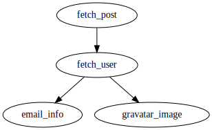

# attr-gather

[]

A gem for creating workflows that "enhance" entities with extra attributes. At a high level, [attr-gather](https://github.com/ianks/attr-gather) provides a process to fetch information from many data sources (such as third party APIs, legacy databases, etc.) in a fully parallelized fashion.

## Usage

### Defining your workflow

```ruby
# define a workflow
class EnhanceProfile
  include Attr::Gather::Workflow

  # contains all the task implementations
  container TasksContainer

  # filter out invalid data using a Dry::Validation::Contract
  # anything that doesn't match this schema will be filtered out
  filter_with_contract do
    params do
      required(:user_id).filled(:integer)

      optional(:user).hash do
        optional(:name).filled(:string)
        optional(:email).filled(:string)
        optional(:gravatar).filled(:string)
        optional(:email_info).hash do
          optional(:deliverable).filled(:bool?)
          optional(:free).filled(:bool?)
        end
      end
    end
  end

  # each task returns a hash of data that will be merged into the result
  task :fetch_post do |t|
    t.depends_on = []
  end

  # will run in parallel
  task :fetch_user do |t|
    t.depends_on = [:fetch_post]
  end

  # will run in parallel
  task :fetch_email_info do |t|
    t.depends_on = [:fetch_user]
  end
end
```

### Defining some tasks

```ruby
class PostFetcher
  def call(attrs)
    res = HTTP.get("https://jsonplaceholder.typicode.com/posts/#{attrs[:id]}")
    post = JSON.parse(res.to_s, symbolize_names: true)

    { title: post[:title], user_id: post[:userId], body: post[:body] }
  end
end
```

```ruby
class UserFetcher
  # will have access to the PostFetcher attributes here
  def call(attrs)
    res = HTTP.get("https://jsonplaceholder.typicode.com/users/#{attrs[:user_id]}")
    user = JSON.parse(res.to_s, symbolize_names: true)

    { user: { name: user[:name], email: user[:email] } }
  end
end
```

```ruby
class EmailInfoFetcher
  # will have access to the PostFetcher attributes here
  def call(user:)
    res = HTTP.timeout(3).get("https://api.trumail.io/v2/lookups/json?email=#{user[:email]}")
    info = JSON.parse(res.to_s, symbolize_names: true)

    # will deep merge with the final result
    { user: { email_info: { deliverable: info[:deliverable], free: info[:free] } } }
  end
end
```

### Registering your tasks

```ruby
class MyContainer
  extend Dry::Container::Mixin
  
  register :fetch_post, PostFetcher
  register :fetch_user, UserFetcher
  register :fetch_email_info, EmailInfoFetcher
end
```

### Run it!

```ruby
enhancer = EnhanceUserProfile.new
enhancer.call(id: 12).value!
```

And this is the result...

```ruby
{
  :id => 12,
  :user_id => 2,
  :user => {
    :email => "Shanna@melissa.tv",
    :name => "Ervin Howell",
    :email_info => { :deliverable => true, :free => true },
    :gravatar => "https://www.gravatar.com/avatar/241af7d19a0a7438794aef21e4e19b79"
  }
}
```

You can even preview it as an SVG!

```ruby
enhancer.to_dot(preview: true) # requires graphviz (brew install graphviz)
```

## Features

- Offers DSL for defining workflows and merging the results from each task
- Execution engine optimally parallelizes the execution of the workflow dependency graph using [concurrent-ruby](https://github.com/ruby-concurrency/concurrent-ruby) Promises
- Very easy to unit test
- Ability to filter out bad/junky data using [dry-validation](https://dry-rb.org/gems/dry-validation) contracts

## What are the main difference between this Ruby project and similar ones?

- Operates on a single entity rather than a list, so easily adoptable in existing systems
- Focuses on the "fetching" and filtering of data solely, and not transformation or storage
- Focuses on having a clean PORO interface to make testing simple
- Provides a declarative interface for merging results from many sources (APIs, legacy databases, etc.) which allows for prioritization

## Links

- [API Documentation](https://www.rubydoc.info/gems/attr-gather)

## Examples

| [](./examples/post_enhancer.rb) |
| :-----------------------------------------------------------------------------: |
|  [Example of workflow that enhances a blog post](./examples/post_enhancer.rb)   |

## Installation

Add this line to your application's Gemfile:

```ruby
gem 'attr-gather'
```

And then execute:

    $ bundle

Or install it yourself as:

    $ gem install attr-gather

## Development

After checking out the repo, run `bin/setup` to install dependencies. Then, run
`rake spec` to run the tests. You can also run `bin/console` for an interactive
prompt that will allow you to experiment.

To install this gem onto your local machine, run `bundle exec rake install`. To
release a new version, update the version number in `version.rb`, and then run
`bundle exec rake release`, which will create a git tag for the version, push
git commits and tags, and push the `.gem` file to
[rubygems.org](https://rubygems.org).

## Contributing

Bug reports and pull requests are welcome on GitHub at
https://github.com/ianks/attr-gather. This project is intended to be a safe,
welcoming space for collaboration, and contributors are expected to adhere to
the [Contributor Covenant](http://contributor-covenant.org) code of conduct.

## License

The gem is available as open source under the terms of the [MIT
License](https://opensource.org/licenses/MIT).

## Code of Conduct

Everyone interacting in the Attr::Gather project’s codebases, issue trackers,
chat rooms and mailing lists is expected to follow the [code of
conduct](https://github.com/ianks/attr-gather/blob/master/CODE_OF_CONDUCT.md).
